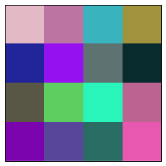

# A notebook

First, some code:

```python
print('hello *world*')
2 * 3
```

```{output:stdout}
hello *world*
```

```{output:result}
6
```

An image:

```python
import numpy as np
import matplotlib.pyplot as plt
%matplotlib inline
np.random.seed(2016)
plt.imshow(np.random.rand(4, 4, 3), interpolation='none')
plt.xticks([])
plt.yticks([])
plt.show()
```

```{output:stderr}
Vendor:  Continuum Analytics, Inc.
Package: mkl
Message: trial mode expires in 30 days
```



```javascript
"This is not part of the previous code cell's output, since it's not Python."
```
